# DO 5: Simple Docker

Практика по контейнеризации, nginx в Docker, собственный образ с мини-сервером на FastCGI, собранный с помощью docker-compose.

## Состав проекта
- Мини-сервер на C + FastCGI (порт 8080)
- nginx-конфигурация с проксированием и /status
- Dockerfile для сборки собственного образа
- docker-compose файл для запуска двух контейнеров

## Запуск
docker compose build
docker compose up

## Part 1. Готовый докер

- **Установила докер `sudo snap install docker`**
- **Скачала образ `docker pull nginx`**
- **Проверила наличие с помощью `docker images`**

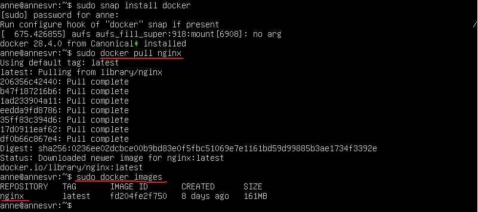

- **Посмотрела информацию о контейнере через `docker inspect [container_id|container_name]`**
- **Проверила, что докер запустился через `docker ps`**

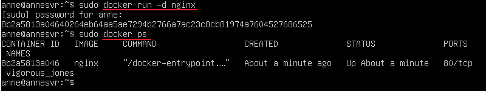

- **Посмотрела информацию о контейнере через `docker inspect [container_id|container_name]`**

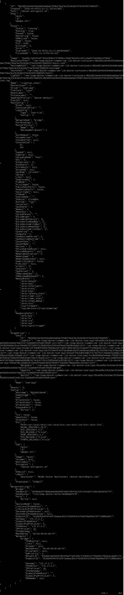

- **Размер контейнера, список замапленных портов и ip контейнера:**
	- **Размер контейнера (ShmSize)**: 67108864
	- **Cписок замапленных портов (Ports)**: 80/tcp: null
	- **IP контейнера (IPAdress)**: 172.17.0.2

- **Остановила докер контейнер через `docker stop [container_id|container_name]`**
- **Проверила, что контейнер остановился через `docker ps`**

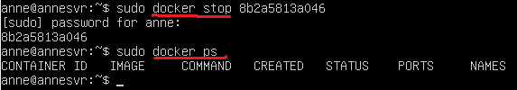

- **Запустила докер с портами 80 и 443 в контейнере, замапленными на такие же порты на локальной машине, через команду _run_.**

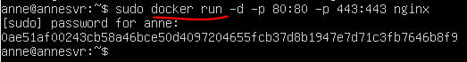

- **Сделала `port forwarding`, чтобы можно было сделать скрин в браузере**

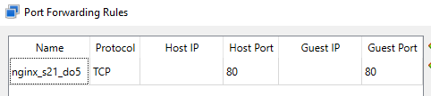

- **Проверила, что в браузере по адресу _localhost:80_ доступна стартовая страница `nginx`**

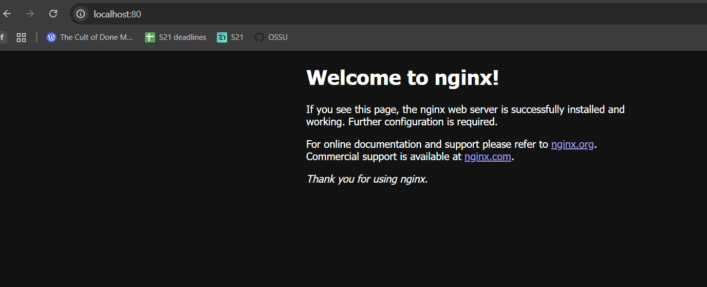

- **Перезапустила докер контейнер через `docker restart [container_id|container_name]**
- **Проверила, что контейнер запустился**
	- **`docker ps` - показывает работающие контейнеры**
	- **`curl localhost:80` - отправляет и получает ответ на http запрос на localhost**

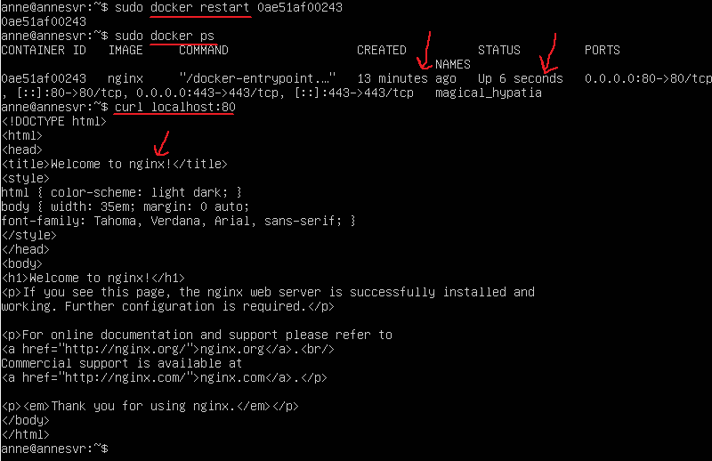
## Part 2. Операции с контейнером

(до выполнения этого пункта я перезапустила виртуальную машину, поэтому container_id другой)

- **Прочитала конфигурационный файл `nginx.conf` внутри докер контейнера через команду `exec`**

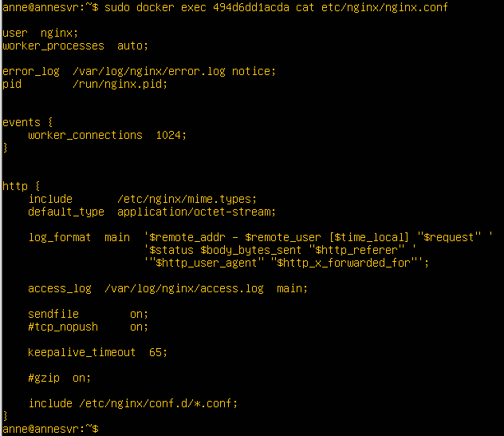

- **Создала на локальной машине файл `nginx.conf`**
- **Настроила в нем по пути _/status_ отдачу страницы статуса сервера nginx**

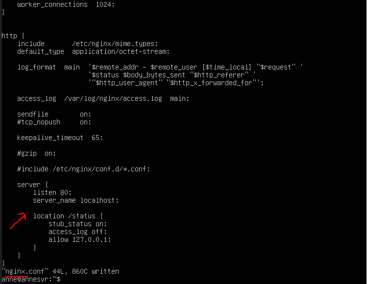

- **Скопировала созданный файл _nginx.conf_ внутрь докер-образа через команду `docker cp`**
- **Перезапустила nginx внутри докер-образа через команду `exec`**

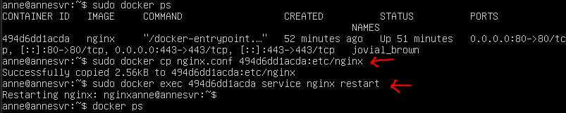

- **Проверила, что по адресу _localhost:80/status_ отдается страничка со статусом сервера nginx**

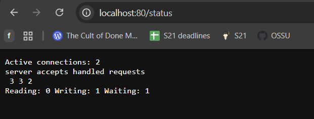

- **Проверила, что по адресу `localhost:80/status` отдается страничка со статусом сервера nginx с помощью `curl`**
- **Экспортировала контейнер в файл ё через команду `export` (плюс проверила, что он экспортирован)** 

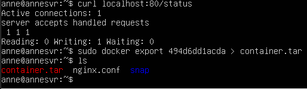

- **Остановила контейнер**

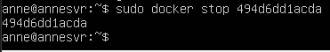

- **Удалила образ через `docker rmi [image_id|repository]`, не удаляя перед этим контейнеры**
- **Удалила остановленный контейнер**

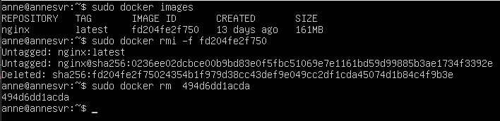

- **Импортировала контейнер обратно через команду `import`**
- **Запустила импортированный контейнер**

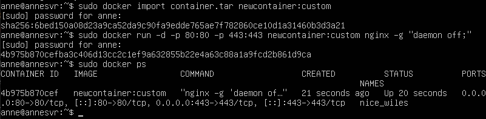

- **Проверила, что по адресу `localhost:80/status` отдается страничка со статусом сервера `nginx` (на основной машине через port forwarding)**

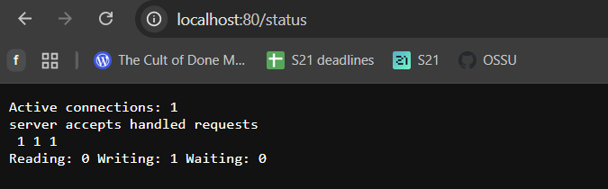

## Part 3. Мини веб-сервер

- **Написала мини-сервер на C и FastCgi, который будет возвращать простейшую страничку с надписью `Hello, World!`**

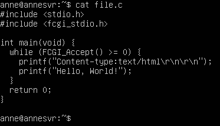

- **Запустила написанный мини-сервер через spawn-fcgi на порту 8080**

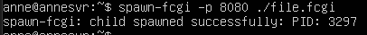

- **Написала свой nginx.conf, который будет проксировать все запросы с 81 порта на 127.0.0.1:8080**

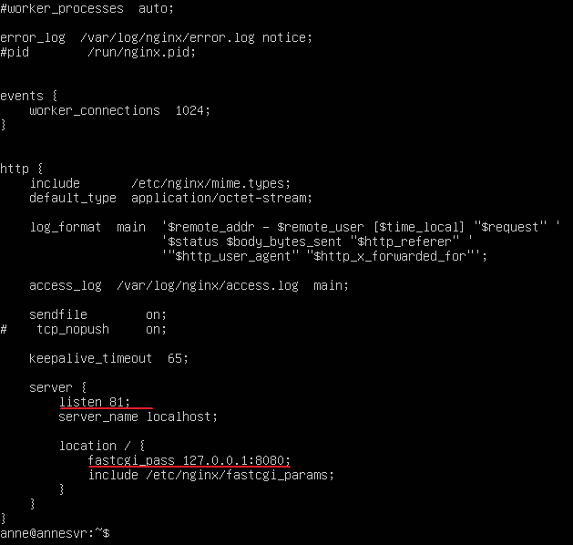

- **Запустила локально nginx с написанной конфигурацией (+ проверила конфиг)**

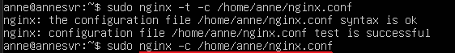

- **Проверила, что в браузере по localhost:81 отдается написанная тобой страничка (здесь опять пришлось сделать port forwarding на основную машину)** 

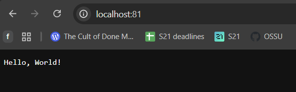

- **То же самое с помощью `curl`**

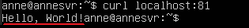
## Part 4. Свой докер

- **Написала свой докер-образ, который соответствует требованиям задания**

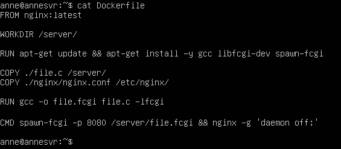

- **Собрала написанный докер-образ через `docker build` при этом указав имя и тег**

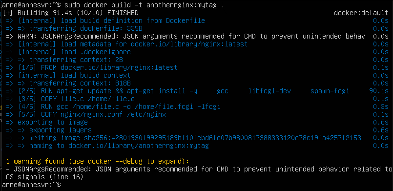

- **Проверила через `docker images`, что все собралось корректно**

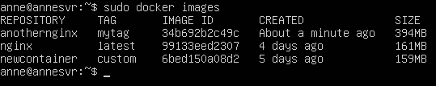

- **Запустила собранный докер-образ с маппингом 81 порта на 80 на локальной машине и маппингом папки ./nginx внутрь контейнера по адресу, где лежат конфигурационные файлы nginx'а** 
- **Проверила что контейнер запустился**
- **Проверила, что по localhost:80 доступна страничка написанного мини сервера (с помощью curl)**

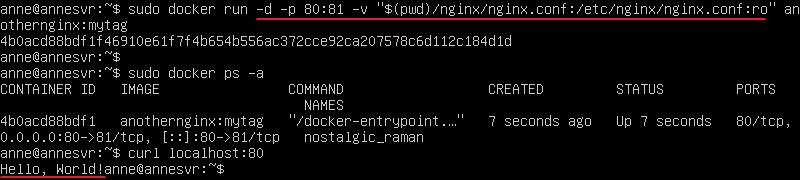

- **Проверила, что по localhost:80 доступна страничка написанного мини сервера в браузере**

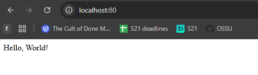

- **Дописала в _./nginx/nginx.conf_ проксирование странички _/status_, по которой надо отдавать статус сервера nginx**

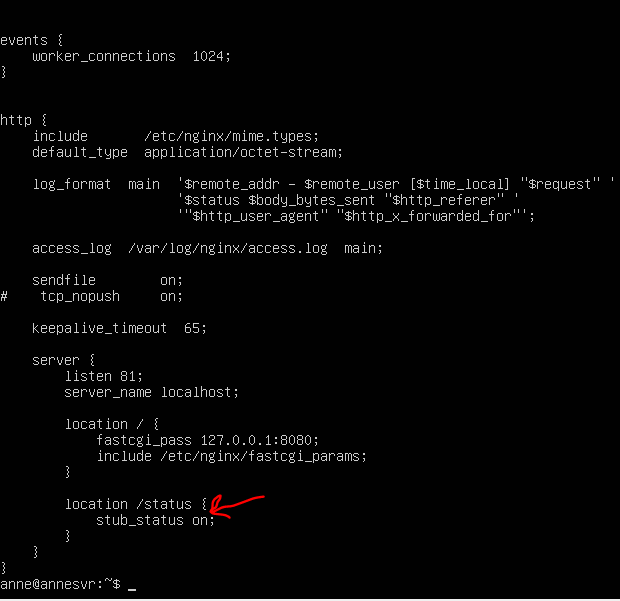

- **Пересобрала докер образ**

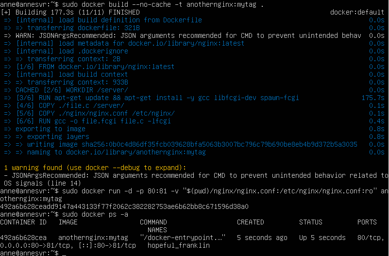

- **Страница status в браузере**

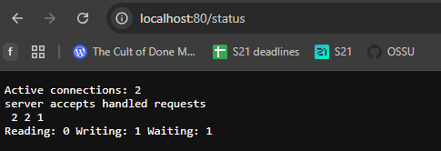

- **Страница status через curl (curl localhost:80/status)**

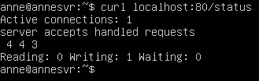

## Part 5. Dockle

- **Просканировала образ из предыдущего задания через `dockle [image_id|repository]`**

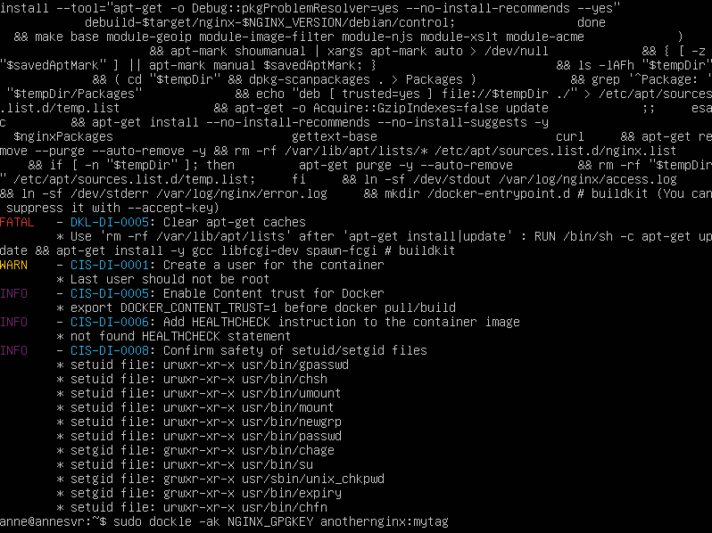

- **Исправила Dockerfile**

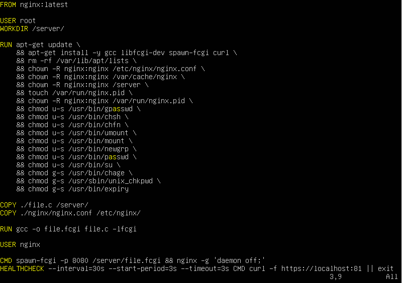

- **Пересобрала образ** 

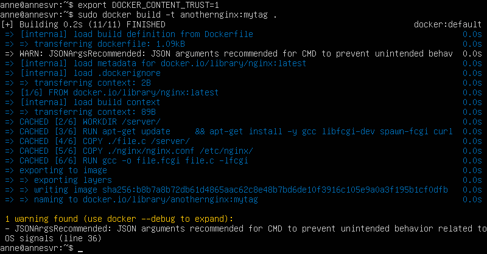

- **Просканировала образ повторно, 0 FATAL, 0 WARN**

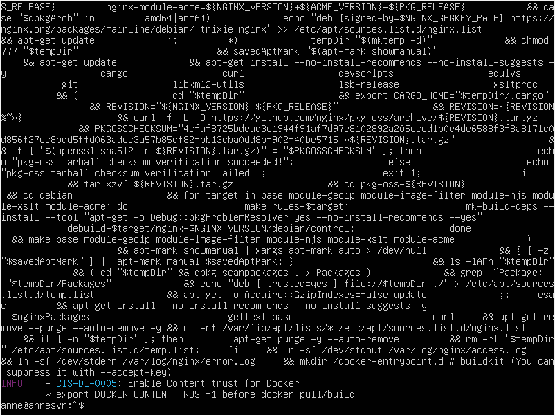

## Part 6. Базовый Docker Compose

- **Написала файл `docker-compose.yml`, который соответствует требованиям задания + конфиг с настройками для `nginx`**

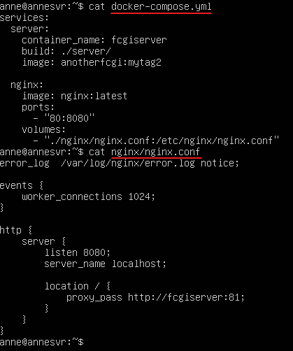

- **Остановила все контейнеры**

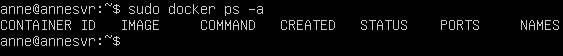

- **Собрала и запустила проект с помощью команд `docker-compose build` и `docker-compose up`**

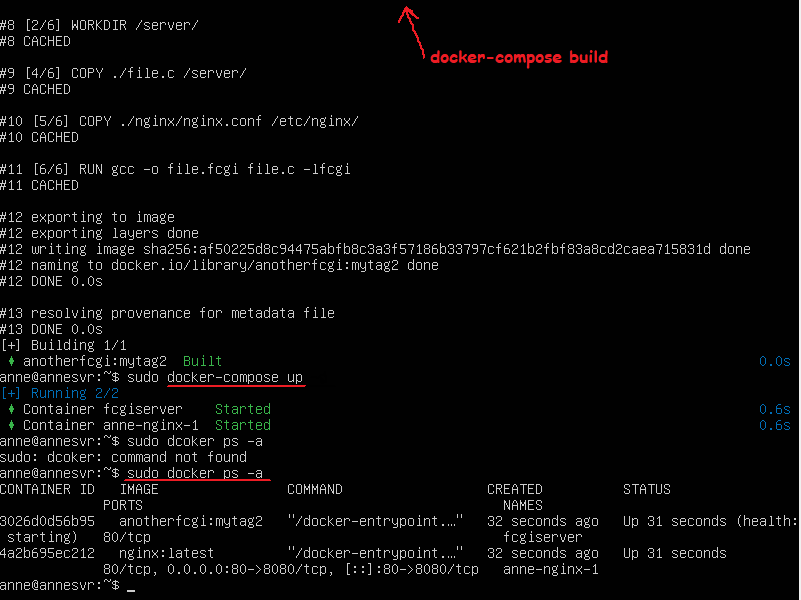

- **Проверила, что в браузере по localhost:80 отдается написанная страничка, как и ранее**

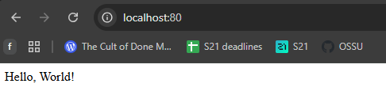

- **То же самое через curl**

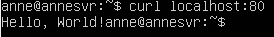