# DO 6: CI/CD

Настройка пайплайна GitLab CI/CD для сборки, тестирования и деплоя SimpleBashUtils.

## Этапы пайплайна
- build: сборка через Makefile
- style: clang-format
- tests: интеграционные тесты
- deploy: копирование артефактов (бинарных файлов) по SSH в /usr/local/bin на второй VM
- notify: бот в Telegram сообщает об успехе/провале CI и CD

## Part 1. Настройка `gitlab-runner`

- **Скачала и установила на виртуальную машину gitlab-runner**
- **Зарегистрировала раннер**

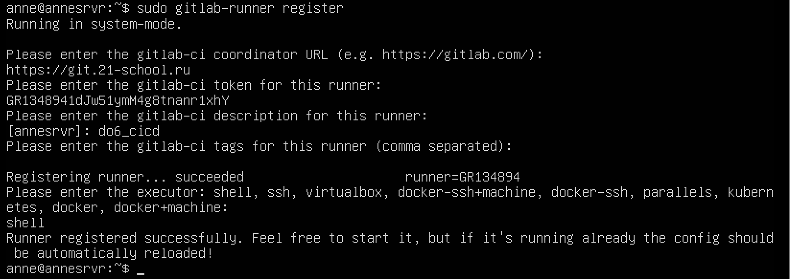

- **После регистрации раннер появился в списке раннеров и работает**

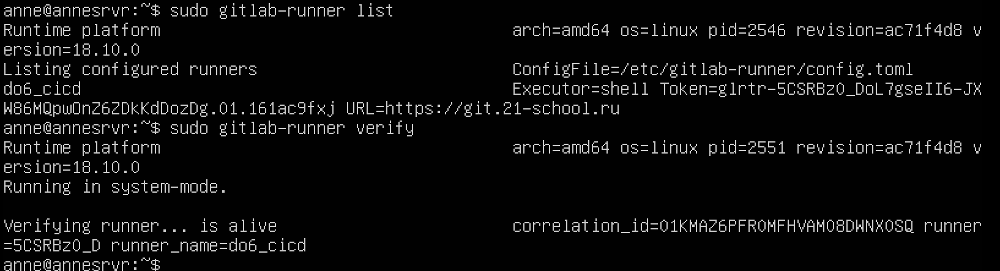

- **Сам gitlab-runner работает как сервис (после применения команды `gitlab-runner install`), то есть может автоматически выполнять работы без запуска команды `gitlab-runner run`**
- **Также для полноценной работы нужно было установить make и clang-format на виртуальную машину и поправить файл .bash_logout, лежащий в корне 

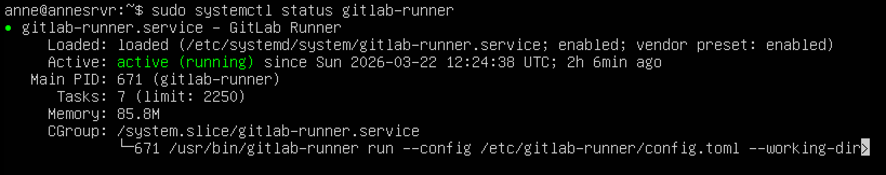

## Part 2. Сборка

- **Написала этап для CI по сборке приложений из проекта SimpleBashUtils**

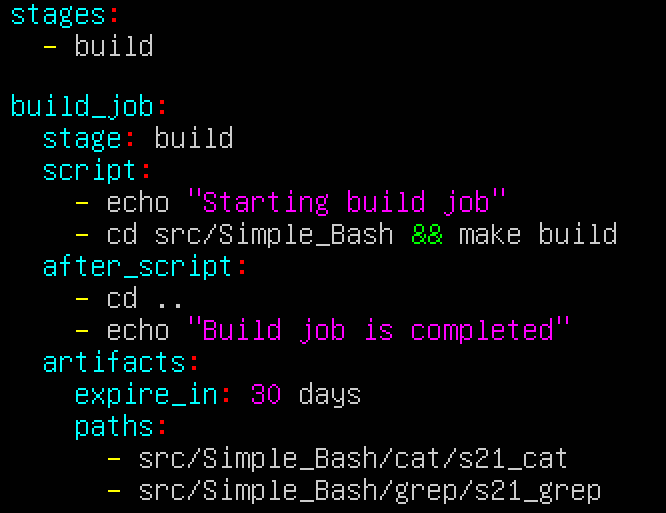

- **Этап сборки прошел успешно**

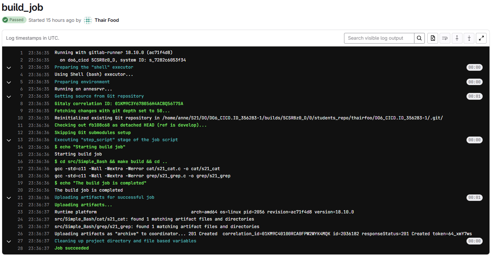

## Part 3. Тест кодстайла

- **Напиши этап для CI, который запускает скрипт кодстайла (clang-format)**

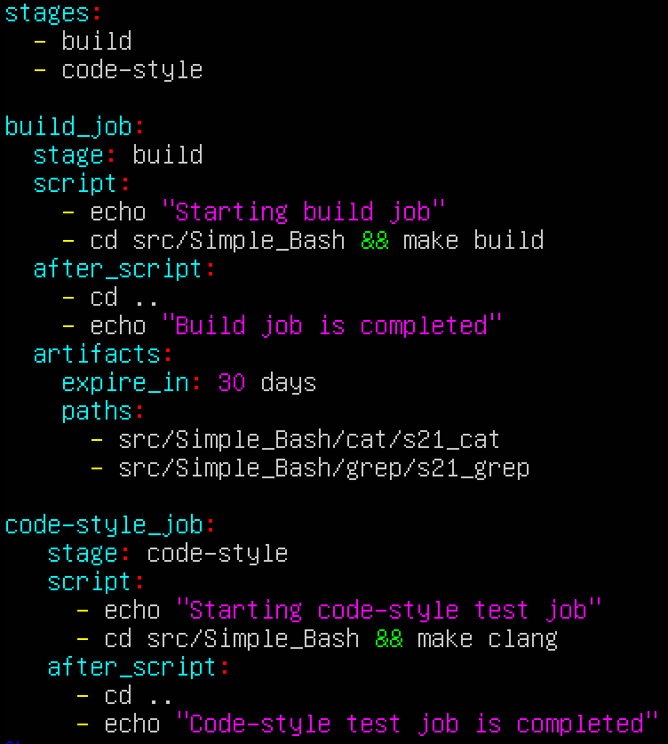

- **Пример зафейленной задачи (с выводом утилиты clang-format)**

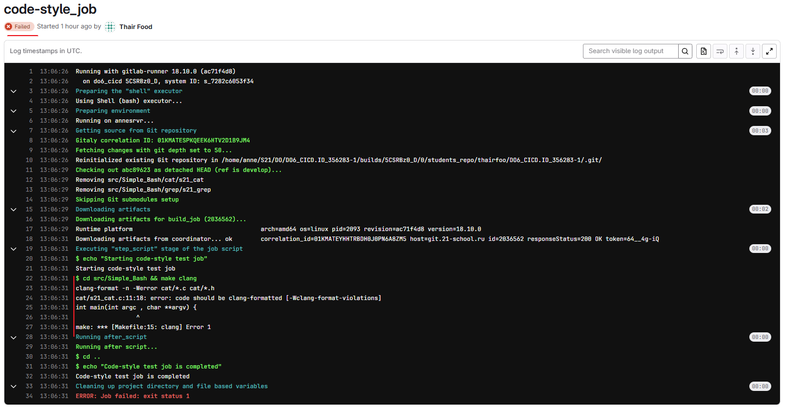

- **Пример пройденных тестов (вывода нет, так как все хорошо)**

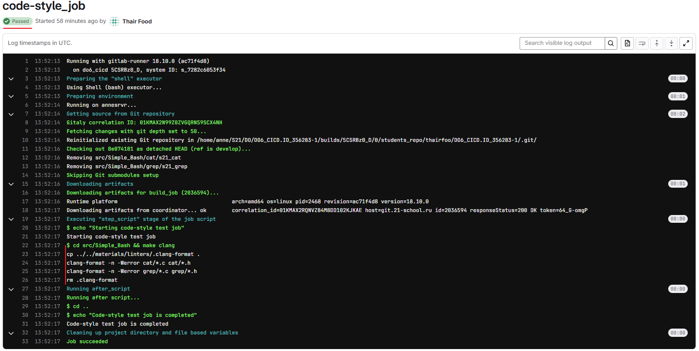

### Part 4. Интеграционные тесты

- **Написала этап для CI, который запустит интеграционные тесты**

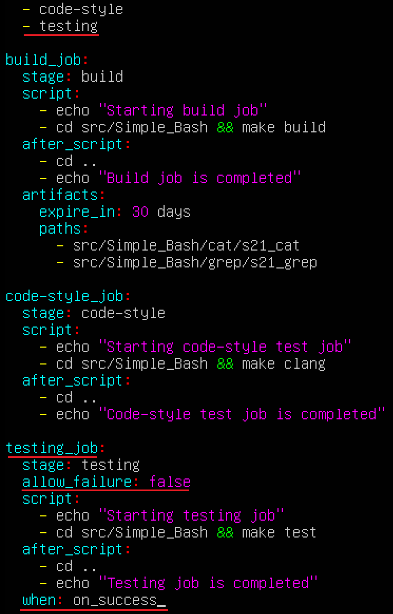

- **Этап работает, только если предыдущий завершился успешно**

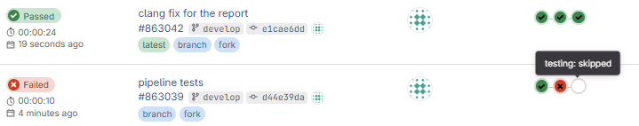

- **Если тесты не прошли, то пайплайн фейлится**

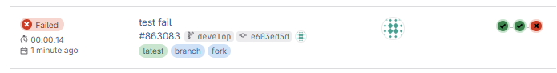

- **Пример непройденных тестов**

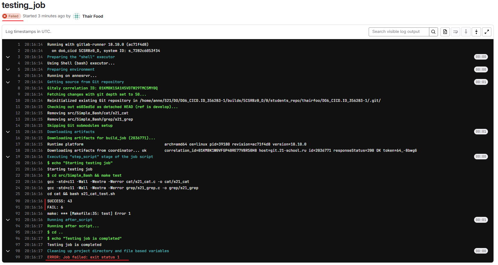

- **Пример пройденных тестов**

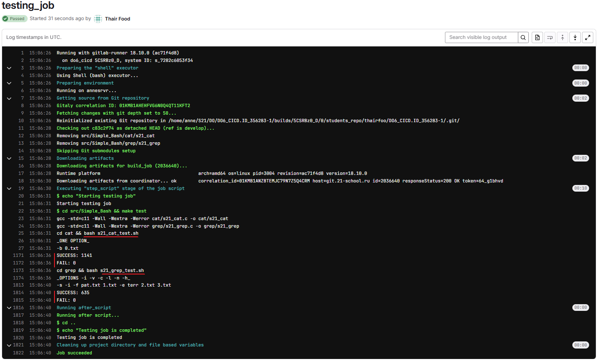

- **Пройденный пайплайн (все три этапа: build, code test, functional tests)** 

## Part 5. Этап деплоя

- **Подняла вторую виртуальную машину Ubuntu Server 22.04 LTS**
- **Соединила машины по аналогии с DO2  (добавлены ip в netplan.yaml)**
- **Cгенерировала ключ через` ssh-keygen` (получилось и для основного пользователя и для gitlab-runner)**
- **Соединение по ssh со второй машиной `anne@192.168.100.11` через` ssh-copy-id -i /var/lib/gitlab-runner (или user) user@ip`, public key добавлен в authorized keys**
-  **Затем скопировала authorized keys в root/.ssh/authorised keys на второй машине**
- **Поправила /etc/ssh/sshd_config, разрешая подключение к root без пароля по ключу из authorized keys (`permitrootlogin prohibit-password`)**

- **Написала bash-скрипт, который при помощи ssh и scp копирует файлы, полученные после сборки (артефакты), в директорию `/usr/local/bin` второй виртуальной машины**
- **Используются команды scp (Secure Copy) - это метод шифрования передачи файлов между системами Unix или Linux), потом смотрим содержимое папки через `ssh` с помощью `ls` (`-lah` показывает подробный список, скрытые файлы, читаемые размеры)**

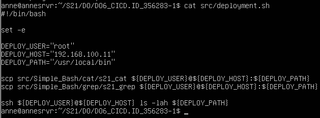

- **Файл .gitlab-ci.yml, запускающий скрипт во время вручную запущенного этапа деплоя**

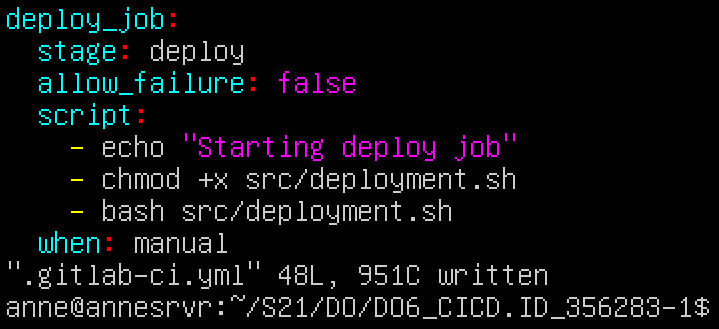

- **Предыдущие этапы пройдены, деплой ждет ручного запуска**

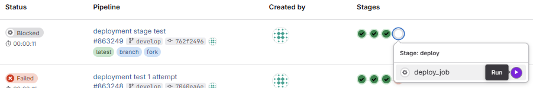

- **Деплой успешно прошел**

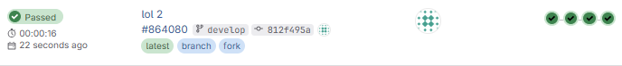

- **Примет выполненной задачи**

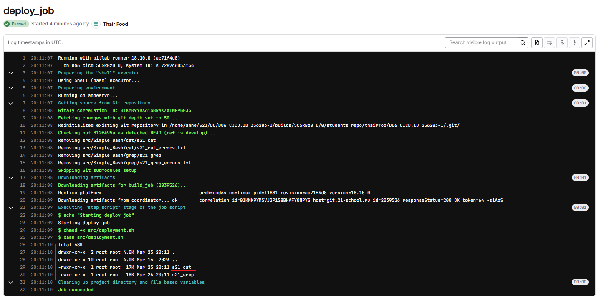
## Part 6. Дополнительно. Уведомления

- **Написала скрипт для бота**

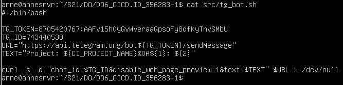

- **Добавила стадию telegram и соответствующие jobs, также добавила уведомления в after_script для остальных стадий**

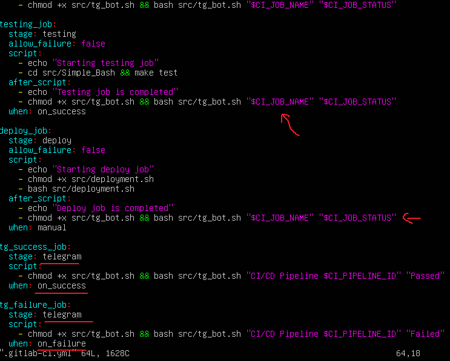

- **Пример непройденного пайплайна (уведомление об ошибке кодстайла и о зафейленном пайплайне)**

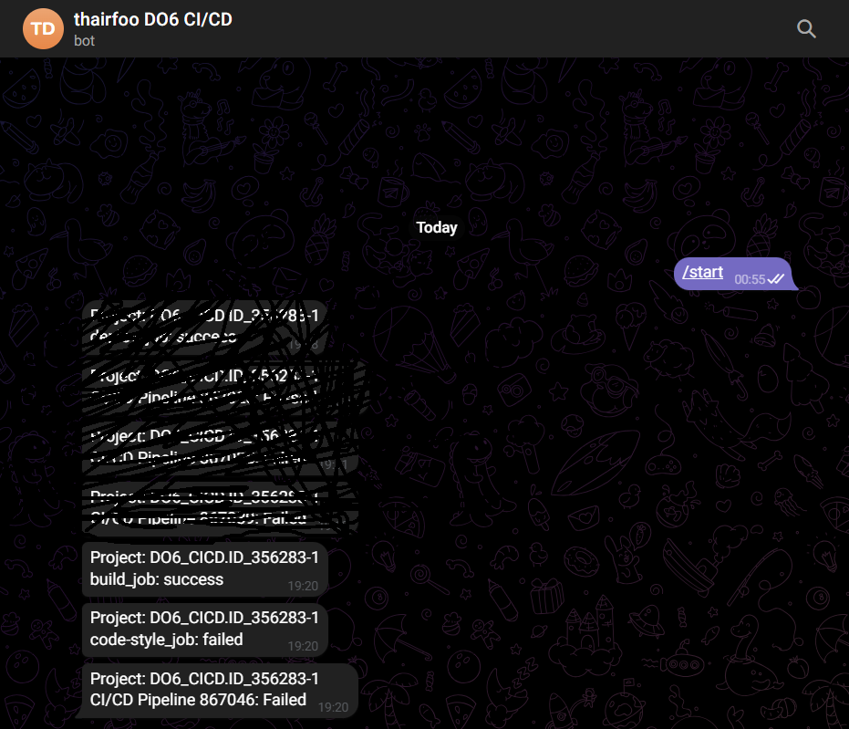

- **Сам пайплайн (выполнилась правильная задача)**

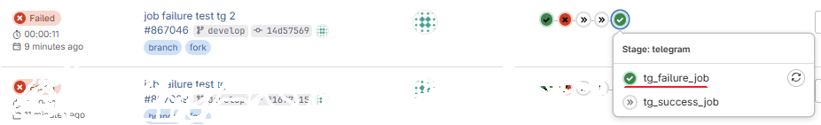

- **Пример пройденного пайплайна (уведомление об ошибке кодстайла и о зафейленном пайплайне)**

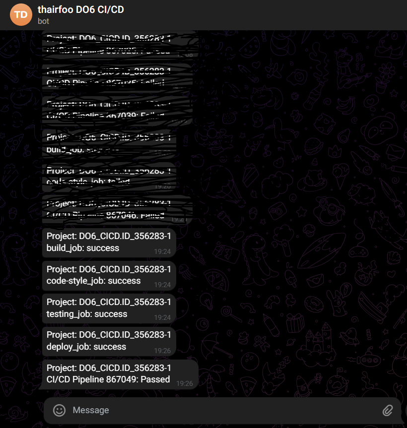

- **Сам пайплайн (тоже выполнилась правильная задача)**

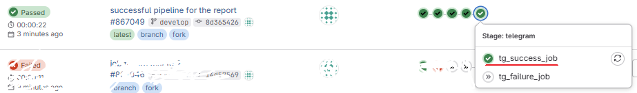